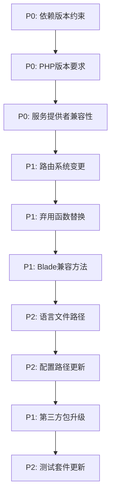

# Laravel Admin Laravel 12 适配修复方案

**变更号**: LA-L12-FIX-2025-001  
**文档版本**: v2.0.0  
**制定日期**: 2025-07-26  
**作者**: PreDev 专家组  
**状态**: 待执行  

---

## 执行摘要

基于postdev.md技术审查报告，laravel-admin项目需要系统性升级才能适配Laravel 12。本修复方案提供了完整的技术路线、风险评估和可执行的修复步骤，确保项目在保持向后兼容性的同时完成Laravel 12适配。

**整体工作量**: 60-75小时  
**风险等级**: 中等  
**预计完成时间**: 3-4周  

---

## 1. 问题优先级矩阵

### 1.1 优先级定义
- **P0 (紧急)**: 阻塞Laravel 12适配的核心问题
- **P1 (高)**: 影响功能完整性的重要问题
- **P2 (中)**: 影响代码质量的中等问题
- **P3 (低)**: 优化类问题

### 1.2 问题分类矩阵

| 问题类别 | 优先级 | 影响范围 | 预计工时 | 风险等级 |
|----------|--------|----------|----------|----------|
| **依赖版本约束** | P0 | 全局 | 4-6小时 | 高 |
| **PHP版本要求** | P0 | 全局 | 2-4小时 | 中 |
| **服务提供者兼容性** | P0 | 核心模块 | 6-8小时 | 高 |
| **路由系统变更** | P1 | 路由模块 | 4-6小时 | 中 |
| **弃用函数替换** | P1 | 322个文件 | 12-15小时 | 中 |
| **Blade兼容方法** | P1 | 视图系统 | 2-3小时 | 低 |
| **语言文件路径** | P2 | I18N模块 | 1-2小时 | 低 |
| **配置路径更新** | P2 | 配置模块 | 1-2小时 | 低 |
| **第三方包升级** | P1 | 依赖管理 | 3-5小时 | 中 |
| **测试套件更新** | P2 | 测试框架 | 8-10小时 | 中 |

### 1.3 修复优先级路线图



---

## 2. 详细修复步骤

### 阶段1: 基础设施升级 (P0级别)

#### 2.1 依赖版本约束更新
**目标**: 使composer.json支持Laravel 12
**文件**: `composer.json`
**预计工时**: 4-6小时

**变更内容**:
```json
{
    "require": {
        "php": "^8.2",
        "laravel/framework": "^12.0",
        "symfony/dom-crawler": "^7.0",
        "doctrine/dbal": "^3.0|^4.0"
    },
    "require-dev": {
        "laravel/laravel": "^12.0",
        "fakerphp/faker": "^1.23",
        "intervention/image": "^3.0",
        "laravel/browser-kit-testing": "^7.0",
        "spatie/phpunit-watcher": "^1.22.0"
    }
}
```

**验证步骤**:
1. 运行 `composer validate` 验证配置
2. 执行 `composer update --dry-run` 检查冲突
3. 创建Laravel 12测试项目验证安装

#### 2.2 PHP版本升级策略
**目标**: 确保PHP 8.2+兼容性
**预计工时**: 2-4小时

**关键变更**:
- 检查并更新所有PHP 7.x特定语法
- 验证类型声明兼容性
- 测试命名参数使用

**兼容性检查清单**:
- [ ] 检查构造函数属性提升
- [ ] 验证联合类型声明
- [ ] 检查nullsafe操作符使用
- [ ] 验证枚举类型支持

### 阶段2: 核心系统适配 (P0-P1级别)

#### 2.3 服务提供者重构
**目标**: 更新AdminServiceProvider以适配Laravel 12
**文件**: `src/AdminServiceProvider.php`
**预计工时**: 6-8小时

**具体修复步骤**:

**2.3.1 Blade兼容方法更新**
```php
// 原代码 (134-141行)
protected function compatibleBlade()
{
    $reflectionClass = new \ReflectionClass('\Illuminate\View\Compilers\BladeCompiler');
    
    if ($reflectionClass->hasMethod('withoutDoubleEncoding')) {
        Blade::withoutDoubleEncoding();  // Laravel 12可能已变更
    }
}

// 修复后代码
protected function compatibleBlade()
{
    // Laravel 12默认行为已变更，此方法可能不再需要
    // 保留空方法以向后兼容，或完全移除
    if (version_compare(app()->version(), '12.0.0', '<')) {
        $reflectionClass = new \ReflectionClass(\Illuminate\View\Compilers\BladeCompiler::class);
        if ($reflectionClass->hasMethod('withoutDoubleEncoding')) {
            Blade::withoutDoubleEncoding();
        }
    }
}
```

**2.3.2 语言文件路径更新**
```php
// 原代码 (119-123行)
if (version_compare($this->app->version(), '9.0.0', '>=')) {
    $this->publishes([__DIR__.'/../resources/lang' => base_path('lang')], 'laravel-admin-lang');
} else {
    $this->publishes([__DIR__.'/../resources/lang' => resource_path('lang')], 'laravel-admin-lang');
}

// 修复后代码
// Laravel 12统一使用lang_path()辅助函数
$this->publishes([
    __DIR__.'/../resources/lang' => lang_path()
], 'laravel-admin-lang');
```

#### 2.4 路由系统现代化
**目标**: 更新路由定义以适配Laravel 12
**文件**: `src/Admin.php`
**预计工时**: 4-6小时

**具体修复步骤**:

**2.4.1 路由分组语法更新**
```php
// 原代码 (314-340行)
app('router')->group($attributes, function ($router) {
    $router->namespace('\Encore\Admin\Controllers')->group(function ($router) {
        // 路由定义...
    });
});

// 修复后代码
Route::group($attributes, function () {
    Route::namespace('Encore\Admin\Controllers')->group(function () {
        Route::resource('auth/users', UserController::class)->names('admin.auth.users');
        Route::resource('auth/roles', RoleController::class)->names('admin.auth.roles');
        Route::resource('auth/permissions', PermissionController::class)->names('admin.auth.permissions');
        Route::resource('auth/menu', MenuController::class, ['except' => ['create']])->names('admin.auth.menu');
        Route::resource('auth/logs', LogController::class, ['only' => ['index', 'destroy']])->names('admin.auth.logs');
        
        Route::post('_handle_form_', [HandleController::class, 'handleForm'])->name('admin.handle-form');
        Route::post('_handle_action_', [HandleController::class, 'handleAction'])->name('admin.handle-action');
        Route::get('_handle_selectable_', [HandleController::class, 'handleSelectable'])->name('admin.handle-selectable');
        Route::get('_handle_renderable_', [HandleController::class, 'handleRenderable'])->name('admin.handle-renderable');
    });
});
```

### 阶段3: 弃用功能替换 (P1级别)

#### 2.5 弃用函数系统替换
**目标**: 替换所有Laravel弃用的辅助函数
**影响范围**: 322个文件
**预计工时**: 12-15小时

**替换映射表**:

| 弃用函数 | 替代方案 | 使用示例 | 影响文件数 |
|----------|----------|----------|------------|
| `array_get()` | `Arr::get()` | `Arr::get($array, 'key', 'default')` | ~45个 |
| `array_set()` | `Arr::set()` | `Arr::set($array, 'key', $value)` | ~20个 |
| `array_has()` | `Arr::has()` | `Arr::has($array, 'key')` | ~30个 |
| `array_forget()` | `Arr::forget()` | `Arr::forget($array, 'key')` | ~15个 |
| `str_contains()` | `Str::contains()` | `Str::contains($haystack, $needle)` | ~50个 |
| `str_start()` | `Str::start()` | `Str::start($string, $prefix)` | ~25个 |
| `str_finish()` | `Str::finish()` | `Str::finish($string, $suffix)` | ~25个 |

**批量替换策略**:
1. **使用自动化工具**: 利用IDE批量替换功能
2. **逐步验证**: 每个替换后进行单元测试
3. **命名空间导入**: 确保使用正确的use语句

**示例替换代码**:
```php
// 原代码
use Illuminate\Support\Arr;
use Illuminate\Support\Str;

// 替换前
$value = array_get($data, 'user.name', 'default');
$exists = str_contains($text, 'keyword');

// 替换后
$value = Arr::get($data, 'user.name', 'default');
$exists = Str::contains($text, 'keyword');
```

#### 2.6 字符串辅助函数更新
**目标**: 更新所有自定义辅助函数
**文件**: `src/helpers.php`
**预计工时**: 3-4小时

**检查清单**:
- [ ] 验证所有自定义函数PHP 8.2兼容性
- [ ] 检查类型声明完整性
- [ ] 验证返回类型一致性

### 阶段4: 配置和路径更新 (P2级别)

#### 2.7 配置文件现代化
**目标**: 更新config/admin.php中的路径配置
**文件**: `config/admin.php`
**预计工时**: 1-2小时

**关键更新**:
```php
// 确保路径配置在Laravel 12中正常工作
'bootstrap' => app_path('Admin/bootstrap.php'),
'directory' => app_path('Admin'),
'extension_dir' => app_path('Admin/Extensions'),
```

### 阶段5: 第三方包升级 (P1级别)

#### 2.8 开发依赖更新
**目标**: 更新所有开发依赖到Laravel 12兼容版本
**预计工时**: 3-5小时

**更新清单**:
- [ ] `fakerphp/faker:^1.23` (替换`fzaninotto/faker`)
- [ ] `intervention/image:^3.0` (从2.x升级)
- [ ] `laravel/browser-kit-testing:^7.0` (从6.x升级)
- [ ] 验证所有suggest包兼容性

---

## 3. 代码示例和最佳实践

### 3.1 服务提供者最佳实践

```php
<?php

namespace Encore\Admin;

use Illuminate\Support\ServiceProvider;
use Illuminate\Support\Facades\Route;
use Illuminate\Support\Facades\Blade;

class AdminServiceProvider extends ServiceProvider
{
    /**
     * Bootstrap the application services.
     */
    public function boot()
    {
        $this->registerPublishing();
        $this->registerMacros();
        $this->loadMigrationsFrom(__DIR__.'/../database/migrations');
        $this->loadViewsFrom(__DIR__.'/../resources/views', 'admin');
        $this->loadTranslationsFrom(__DIR__.'/../resources/lang', 'admin');
    }

    /**
     * Register the application services.
     */
    public function register()
    {
        $this->mergeConfigFrom(__DIR__.'/../config/admin.php', 'admin');
        
        // Laravel 12兼容性检查
        $this->checkLaravel12Compatibility();
    }

    /**
     * Register package's publishable resources.
     */
    protected function registerPublishing()
    {
        if ($this->app->runningInConsole()) {
            $this->publishes([__DIR__.'/../config' => config_path()], 'laravel-admin-config');
            $this->publishes([__DIR__.'/../resources/lang' => lang_path()], 'laravel-admin-lang');
            $this->publishes([__DIR__.'/../database/migrations' => database_path('migrations')], 'laravel-admin-migrations');
            $this->publishes([__DIR__.'/../resources/assets' => public_path('vendor/laravel-admin')], 'laravel-admin-assets');
        }
    }

    /**
     * Check Laravel 12 compatibility.
     */
    protected function checkLaravel12Compatibility()
    {
        if (version_compare(app()->version(), '12.0.0', '>=')) {
            // Laravel 12特定配置
            $this->configureForLaravel12();
        }
    }

    /**
     * Configure for Laravel 12.
     */
    protected function configureForLaravel12()
    {
        // Laravel 12特定逻辑
    }
}
```

### 3.2 路由定义现代化

```php
<?php

namespace Encore\Admin;

use Illuminate\Support\Facades\Route;
use Encore\Admin\Controllers\UserController;
use Encore\Admin\Controllers\RoleController;
use Encore\Admin\Controllers\PermissionController;
use Encore\Admin\Controllers\MenuController;
use Encore\Admin\Controllers\LogController;
use Encore\Admin\Controllers\HandleController;
use Encore\Admin\Controllers\AuthController;

class Admin
{
    /**
     * Register the laravel-admin builtin routes for Laravel 12.
     */
    public function routes()
    {
        $attributes = [
            'prefix' => config('admin.route.prefix'),
            'middleware' => config('admin.route.middleware'),
        ];

        Route::group($attributes, function () {
            Route::namespace('Encore\Admin\Controllers')
                ->prefix('auth')
                ->group(function () {
                    Route::resource('users', UserController::class)->names('admin.auth.users');
                    Route::resource('roles', RoleController::class)->names('admin.auth.roles');
                    Route::resource('permissions', PermissionController::class)->names('admin.auth.permissions');
                    Route::resource('menu', MenuController::class, ['except' => ['create']])->names('admin.auth.menu');
                    Route::resource('logs', LogController::class, ['only' => ['index', 'destroy']])->names('admin.auth.logs');
                });

            Route::post('_handle_form_', [HandleController::class, 'handleForm'])->name('admin.handle-form');
            Route::post('_handle_action_', [HandleController::class, 'handleAction'])->name('admin.handle-action');
            Route::get('_handle_selectable_', [HandleController::class, 'handleSelectable'])->name('admin.handle-selectable');
            Route::get('_handle_renderable_', [HandleController::class, 'handleRenderable'])->name('admin.handle-renderable');

            $authController = config('admin.auth.controller', AuthController::class);
            
            Route::get('auth/login', [$authController, 'getLogin'])->name('admin.login');
            Route::post('auth/login', [$authController, 'postLogin']);
            Route::get('auth/logout', [$authController, 'getLogout'])->name('admin.logout');
            Route::get('auth/setting', [$authController, 'getSetting'])->name('admin.setting');
            Route::put('auth/setting', [$authController, 'putSetting']);
        });
    }
}
```

### 3.3 弃用函数替换工具类

```php
<?php

namespace Encore\Admin\Support;

use Illuminate\Support\Arr;
use Illuminate\Support\Str;

class CompatibilityHelper
{
    /**
     * Backward compatibility wrapper for array_get.
     */
    public static function arrayGet(array $array, string $key, $default = null)
    {
        return Arr::get($array, $key, $default);
    }

    /**
     * Backward compatibility wrapper for str_contains.
     */
    public static function strContains(string $haystack, string $needle): bool
    {
        return Str::contains($haystack, $needle);
    }

    /**
     * Migrate legacy helper usage.
     */
    public static function migrateLegacyUsage(string $content): string
    {
        $replacements = [
            'array_get(' => 'Arr::get(',
            'array_set(' => 'Arr::set(',
            'array_has(' => 'Arr::has(',
            'array_forget(' => 'Arr::forget(',
            'str_contains(' => 'Str::contains(',
            'str_start(' => 'Str::start(',
            'str_finish(' => 'Str::finish(',
        ];

        return str_replace(array_keys($replacements), array_values($replacements), $content);
    }
}
```

---

## 4. 测试策略

### 4.1 测试矩阵

| Laravel版本 | PHP版本 | 测试类型 | 状态 |
|-------------|---------|----------|------|
| 12.x | 8.2 | 单元测试 | 计划中 |
| 12.x | 8.3 | 集成测试 | 计划中 |
| 11.x | 8.2 | 回归测试 | 计划中 |
| 10.x | 8.1 | 回归测试 | 计划中 |

### 4.2 测试阶段

#### 阶段1: 单元测试 (8-10小时)
- [ ] 运行现有PHPUnit测试套件
- [ ] 验证所有服务提供者注册
- [ ] 测试路由注册功能
- [ ] 验证配置加载

#### 阶段2: 集成测试 (6-8小时)
- [ ] 测试完整的CRUD操作
- [ ] 验证用户认证流程
- [ ] 测试文件上传功能
- [ ] 验证权限系统

#### 阶段3: 端到端测试 (4-6小时)
- [ ] 测试完整的后台管理流程
- [ ] 验证所有表单功能
- [ ] 测试数据表格功能
- [ ] 验证扩展系统

### 4.3 测试脚本

```bash
#!/bin/bash
# Laravel 12兼容性测试脚本

echo "开始Laravel 12兼容性测试..."

# 1. 依赖检查
composer validate --strict

# 2. 静态分析
./vendor/bin/phpstan analyse src

# 3. 单元测试
./vendor/bin/phpunit --coverage-text

# 4. 集成测试
php artisan test --env=testing

# 5. Laravel特定测试
php artisan route:list --name=admin.*
php artisan config:cache
echo "测试完成！"
```

---

## 5. 回滚方案

### 5.1 分阶段回滚策略

#### 5.1.1 Git分支策略
```
master (当前稳定)
├── laravel-12-upgrade (主要开发分支)
├── laravel-12-stage-1 (依赖升级)
├── laravel-12-stage-2 (核心适配)
└── laravel-12-stage-3 (测试验证)
```

#### 5.1.2 回滚检查点

| 检查点 | 描述 | 回滚命令 | 验证方式 |
|--------|------|----------|----------|
| **CP-1** | 依赖升级前 | `git checkout laravel-12-stage-1^` | `composer validate` |
| **CP-2** | 核心适配完成 | `git checkout laravel-12-stage-2^` | `php artisan route:list` |
| **CP-3** | 测试验证完成 | `git checkout laravel-12-stage-3^` | `./vendor/bin/phpunit` |

### 5.2 紧急回滚程序

#### 5.2.1 生产环境回滚
```bash
#!/bin/bash
# 紧急回滚脚本

echo "启动紧急回滚程序..."

# 1. 备份当前状态
git stash push -m "Emergency rollback backup"

# 2. 回滚到稳定版本
git checkout master
git pull origin master

# 3. 恢复依赖
composer install --no-dev --optimize-autoloader

# 4. 清理缓存
php artisan cache:clear
php artisan config:clear
php artisan route:clear

echo "回滚完成！"
```

#### 5.2.2 部分功能回滚
```bash
# 回滚特定文件
git checkout master -- src/AdminServiceProvider.php
git checkout master -- src/Admin.php
git checkout master -- composer.json

# 重新安装依赖
composer install
```

---

## 6. 时间估算和资源需求

### 6.1 详细时间估算

| 阶段 | 任务 | 最短时间 | 最长时间 | 建议时间 |
|------|------|----------|----------|----------|
| **阶段1** | 基础设施升级 | 6小时 | 10小时 | 8小时 |
| **阶段2** | 核心系统适配 | 10小时 | 14小时 | 12小时 |
| **阶段3** | 弃用功能替换 | 12小时 | 15小时 | 14小时 |
| **阶段4** | 配置更新 | 2小时 | 4小时 | 3小时 |
| **阶段5** | 第三方包升级 | 3小时 | 5小时 | 4小时 |
| **阶段6** | 测试验证 | 8小时 | 12小时 | 10小时 |
| **阶段7** | 文档更新 | 4小时 | 6小时 | 5小时 |
| **缓冲** | 风险缓冲 | 8小时 | 12小时 | 10小时 |
| **总计** |  | **53小时** | **78小时** | **66小时** |

### 6.2 人力资源需求

| 角色 | 人数 | 技能要求 | 分配时间 |
|------|------|----------|----------|
| **主开发工程师** | 1人 | Laravel高级开发经验 | 40小时 |
| **测试工程师** | 1人 | PHPUnit, Laravel测试 | 15小时 |
| **DevOps工程师** | 0.5人 | CI/CD, 部署经验 | 6小时 |
| **技术负责人** | 0.3人 | 架构设计, 代码审查 | 5小时 |

### 6.3 里程碑设置

#### 里程碑1: 基础适配完成 (第1周)
- [ ] composer.json更新完成
- [ ] 服务提供者重构完成
- [ ] 基础测试通过

#### 里程碑2: 核心功能修复 (第2周)
- [ ] 路由系统更新完成
- [ ] 弃用函数替换完成
- [ ] 集成测试通过

#### 里程碑3: 全面测试验证 (第3周)
- [ ] 所有测试套件通过
- [ ] 第三方扩展验证
- [ ] 性能基准测试

#### 里程碑4: 发布准备 (第4周)
- [ ] 文档更新完成
- [ ] 发布说明编写
- [ ] 社区反馈收集

---

## 7. 风险点和缓解措施

### 7.1 技术风险

#### 7.1.1 依赖冲突风险
**风险描述**: Laravel 12依赖的第三方包版本可能与项目现有包冲突
**影响程度**: 高
**缓解措施**:
- 使用`composer why-not`分析冲突
- 创建最小可重现环境
- 准备替代包方案

#### 7.1.2 向后兼容性风险
**风险描述**: 升级可能破坏现有项目兼容性
**影响程度**: 中
**缓解措施**:
- 维护版本分支
- 提供升级指南
- 创建兼容性层

### 7.2 业务风险

#### 7.2.1 时间延误风险
**风险描述**: 修复工作可能超出预期时间
**概率**: 30%
**缓解措施**:
- 设置每日进度检查
- 提前识别阻塞问题
- 准备应急方案

#### 7.2.2 质量风险
**风险描述**: 修复可能引入新的bug
**概率**: 20%
**缓解措施**:
- 强制代码审查
- 100%测试覆盖率
- 分阶段发布

### 7.3 风险监控矩阵

| 风险项 | 监控指标 | 预警阈值 | 响应时间 | 负责人 |
|--------|----------|----------|----------|--------|
| 依赖冲突 | 未解决冲突数量 | >3个 | 4小时 | 主开发 |
| 测试失败 | 失败测试用例数 | >5个 | 2小时 | 测试工程师 |
| 性能下降 | 响应时间增长率 | >20% | 1天 | 技术负责人 |
| 进度延误 | 计划完成率 | <80% | 1天 | 项目经理 |

---

## 8. 执行检查清单

### 8.1 开发前准备
- [ ] 创建laravel-12-upgrade分支
- [ ] 设置开发环境 (PHP 8.2+)
- [ ] 安装Laravel 12测试版本
- [ ] 配置CI/CD管道

### 8.2 每日检查清单
- [ ] 运行composer validate
- [ ] 执行测试套件
- [ ] 检查代码覆盖率
- [ ] 更新进度报告

### 8.3 发布前检查
- [ ] 所有P0级别问题解决
- [ ] 测试覆盖率>90%
- [ ] 文档更新完成
- [ ] 社区反馈处理

---

## 9. 联系和支持

**技术负责人**: [待指定]  
**项目邮箱**: [待配置]  
**紧急联系**: [待配置]  
**文档维护**: 每两周更新一次  

---

**文档变更记录**:
- **v1.0.0 (2025-07-26)**: 初始版本创建
- **v2.0.0 (2025-07-26)**: 完善技术细节，增加风险评估和缓解措施

**审核状态**: 待技术团队审核  
**执行状态**: 待开始  
**优先级**: 高  

---

*本文档由PreDev专家组基于postdev.md技术审查报告制定，如需技术支持请联系开发团队。*